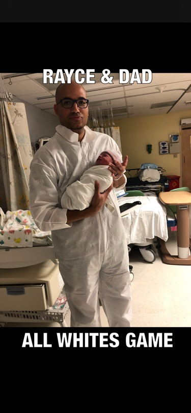

# Memed-ImagePicker

**FUNCTION** 
The app allows users to take or pick a picture from from their phone and add text at the top and bottom it to create a meme.
The meme can be shared on Facebook, Twitter, by SMS or email. 

**UI** 
Three pages of content: a meme editor, sent memes and meme detail. When app launches user sees sent memes appear in two tabs: 
a table view and a collection view. UThe Meme Editor view has a toolbar with two buttons: one that allows user to open the 
Photo Album to select an image, one that launches the camera. Images are scaled properly and work in portrait or landscape 
view.

**DEMO** 

